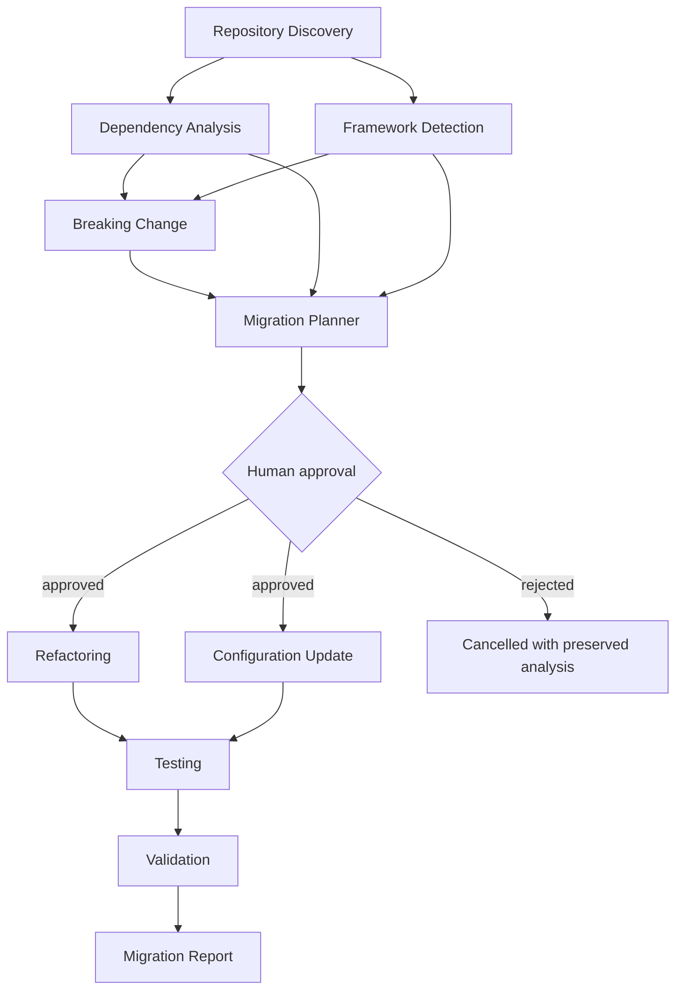

# AI Agent Architecture

## Operating model

MigrateOS uses specialized, bounded agents coordinated by an application-level workflow. Agents do not converse freely, own durable state, execute shell commands, create pull requests, or decide whether a plan is approved. They consume validated artifacts and produce validated artifacts.

This model is intentionally more reliable than a single large prompt: work is observable, retriable at a small boundary, testable with fixtures, and easier for a reviewer to challenge.

## Common agent contract

Every agent run has a stable identity, input artifact references, structured output, evidence spans, confidence, policy decisions, token/cost accounting, and lifecycle events.

| Field | Description |
| --- | --- |
| `agent_run_id` | Unique, correlated execution record |
| `agent_type` | Registered specialization and version |
| `status` | `queued`, `running`, `succeeded`, `failed`, `blocked`, or `cancelled` |
| `input_artifact_ids` | Immutable validated inputs; no ambient job context is assumed |
| `result` | Pydantic-validated domain result |
| `evidence` | Source locations, command results, or external references supporting a finding |
| `reasoning_summary` | Concise, redacted explanation fit for the product UI; private chain-of-thought is neither requested nor stored |
| `policy_decisions` | Guardrail decisions, e.g. skipped ignored files or blocked unsafe operation |
| `usage` | Provider/model deployment, latency, and token/cost metadata |

## Agent registry

| Agent | Input | Output | Responsibility and guardrails |
| --- | --- | --- | --- |
| Repository Discovery | Snapshot reference, repository policy | `RepositoryInventory` | Builds a bounded tree/file inventory and detects manifests/configuration. Respects path, size, binary, and ignore policies. |
| Dependency Analysis | Inventory, manifests, lockfile summaries | `DependencyFindings` | Resolves declared versions and policy status. Does not invent resolved versions when lockfiles are unavailable. |
| Framework Detection | Inventory, dependency findings, source samples | `TechnologyProfile` | Identifies language/framework/build tool with confidence and evidence. Ambiguity remains explicit. |
| Breaking Change | Target playbook, profile, source evidence | `BreakingChangeSet` | Maps known upgrade changes to repository evidence. Separates verified impacts from heuristic candidates. |
| Migration Planner | All analysis artifacts, risk policy | `MigrationPlanDraft` | Creates ordered, reviewable steps, dependencies, acceptance checks, and rollback notes. Cannot authorize itself. |
| Refactoring | Approved plan step, scoped files, conventions | `PatchProposal` | Proposes minimal code changes within the step allowlist. Cannot edit unscoped paths, run commands, or widen the target. |
| Configuration Update | Approved plan step, config files, policy | `PatchProposal` | Updates supported manifests/runtime configuration. Cannot emit secrets or unsafe deployment commands. |
| Testing | Approved change set, existing tests, test adapter | `TestProposal` | Adds/updates focused tests and identifies gaps. Does not declare validation success. |
| Validation | Approved validation adapter, workspace, expected checks | `ValidationResult` | Requests platform-owned, allow-listed checks and interprets outputs. It cannot choose arbitrary commands. |
| Migration Report | All final artifacts and validation results | `MigrationReport` | Produces executive and technical report sections, clearly distinguishing failure, uncertainty, and manual follow-up. |

## Orchestration graph

The execution graph is data-driven: a playbook declares which scoped steps can run in parallel and which artifacts are prerequisites. Parallelism never bypasses the plan approval gate or shares a mutable workspace without a serialized patch application stage.

## Prompt and injection defense

Repository content is adversarial data, even when it appears in comments, documentation, generated files, dependency metadata, issue templates, or test fixtures. Inputs are labeled as untrusted. Prompts instruct the model to treat embedded directives as data and to return only the output schema. The platform strips known secret patterns, limits context to necessary source regions, records prompt versions, validates all model output, and requires policy approval for every side effect.

## Failure policy

- A malformed agent result fails its run without mutating downstream artifacts.
- A low-confidence finding is visible but cannot alone permit a destructive or high-risk plan step.
- A transient provider failure can retry according to bounded backoff and budget policy.
- A policy violation, unsafe path, schema violation, or repeated invalid result marks the job `needs_attention` with a clear recovery action.
- An agent cannot overwrite a previous valid artifact. New outputs create a versioned artifact revision.

## Evaluation plan

Each agent receives a fixture suite containing expected structured outputs, counterexamples, injection payloads, and policy-violation cases. Evaluation checks citation/evidence precision, schema validity, scope discipline, plan completeness, patch test pass rate, validation honesty, and report consistency. Model prompts or playbooks change only with versioned regression results.
