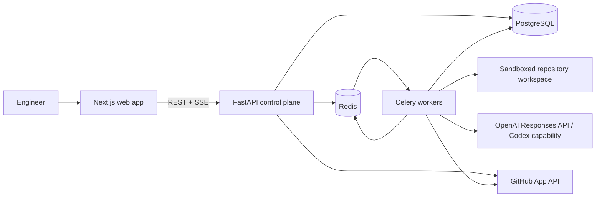
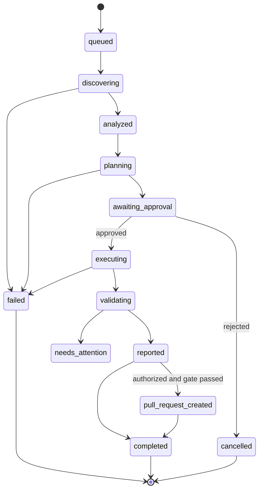

# System Architecture

## Architectural style

MigrateOS uses a modular monolith for the control plane and independently scalable workers for repository and model work. This is intentionally simpler than microservices for an early open-source product while preserving clean boundaries. FastAPI owns request handling and job coordination; Celery workers own long-running work; PostgreSQL holds authoritative state; Redis transports short-lived work and event fan-out.

**Milestone 2 implementation:** `apps/frontend` is a standalone Next.js application; `backend` contains API/domain/application/infrastructure modules; `workers` contains the Celery process. Docker Compose starts all five local services with health-gated dependencies. The initial API exposes a liveness contract and a development-only bearer authentication boundary that rejects all requests unless explicitly configured.

**Milestone 3 implementation:** repository intelligence is a deterministic application service composed of importer, bounded scanner, technology/dependency/architecture analyzers, and knowledge-graph builder. Each stage emits ordered structured events. Repository contents are read as untrusted data; no repository script is executed during analysis.

## Clean Architecture boundaries

| Layer | Owns | Must not depend on |
| --- | --- | --- |
| Domain | Entities, value objects, policies, state transitions, domain events | HTTP, ORM, Celery, OpenAI, GitHub, filesystem |
| Application | Use cases, orchestration ports, authorization decisions, transactions | Framework-specific client code |
| API | Request/response schemas, auth middleware, REST/SSE delivery | ORM queries, agent prompts |
| Infrastructure | SQLAlchemy repositories, Redis, GitHub, OpenAI, Git, Tree-sitter, sandbox adapters | API handlers |
| Workers | Task entrypoints and reliable delivery of application use cases | Direct browser-facing concerns |
| Frontend | User journeys and view state via the public API | Backend implementation details |

Dependencies point inward. Ports are defined by the application layer and implemented by infrastructure. This makes model providers, source-control hosts, runners, and queue technology replaceable without contaminating migration policies.

## Core execution lifecycle

The status transition policy is enforced centrally in the domain layer. Workers cannot skip approval or report an unvalidated result as successful.

## Key design decisions

| Decision | Why |
| --- | --- |
| Typed artifacts between agents | Prevents ambiguous handoffs, supports replay, enables per-step validation, and limits prompt-injection propagation. |
| Immutable source snapshots | Ensures reports and patches can be traced to an exact revision despite branch movement. |
| Asynchronous jobs + SSE | Analysis and migration exceed request timeouts; SSE provides simple ordered server-to-client event streaming with automatic reconnection. |
| Sandboxed, allow-listed runner | Repository content is untrusted. Build commands are selected from a policy-controlled adapter—not model output or repository scripts alone. |
| Plan approval before mutations | Gives teams a meaningful chance to assess scope, risk, and cost. |
| PostgreSQL as source of truth | Supports transactional state, auditability, rich querying, and Alembic migrations. Redis remains non-authoritative. |
| Model adapter port | Allows supported OpenAI Responses API/Codex invocations now while preserving test doubles and a controlled future provider boundary. |

## Security trust boundaries

1. Browser clients are untrusted; the API validates all input with Pydantic, authorizes every resource access, and emits only redacted event payloads.
2. Repository contents are hostile input. They can inform analysis but cannot set system instructions, choose tools, or authorize commands.
3. Workers run with a per-job workspace, no inherited developer credentials, restricted filesystem/network access, CPU/memory/time limits, and a curated executable allowlist.
4. Secrets are supplied by a runtime secret manager to service processes only. They are never stored in job records, prompts, agent logs, reports, or frontend state.
5. GitHub write operations use a scoped installation token and are gated by policy plus an explicit user approval record.

## Reliability and observability

Each request, job, execution, agent run, and external call carries a correlation ID. Application events are written transactionally to PostgreSQL before they are emitted to SSE or WebSocket clients; both transports replay from durable storage after reconnect. Tasks use deterministic idempotency keys and persist checkpoints only after their output artifact validates. OpenTelemetry-compatible traces, structured logs, metrics, and redacted error records make a failed run diagnosable.

## Architecture decision records

[ADR-0001](decisions/ADR-0001-modular-monolith-and-workers.md) records the initial deployment boundary. Future material changes require a new ADR before code is merged.
