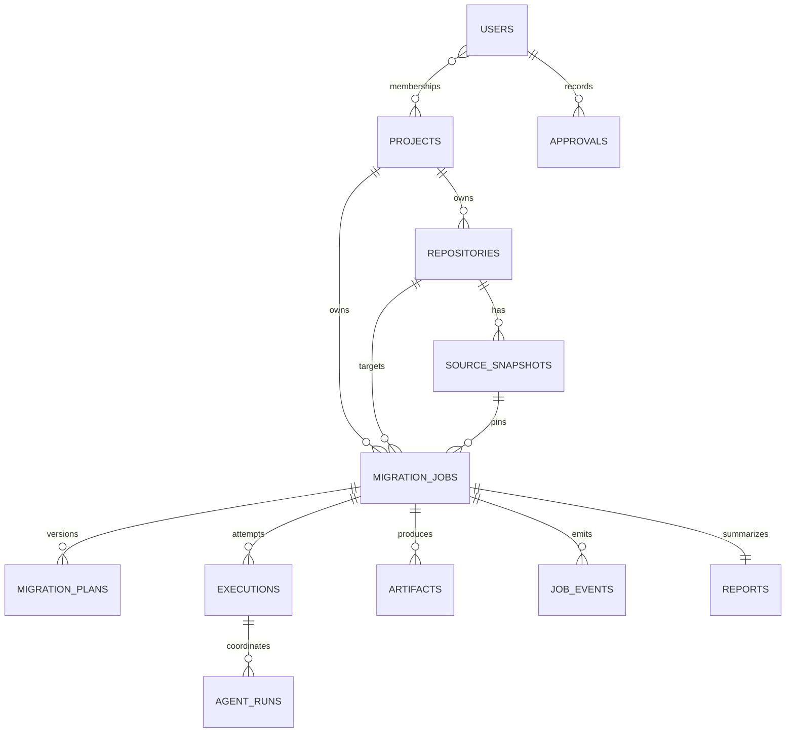

# Database Design

## Principles

PostgreSQL is the authoritative, auditable system of record. Foreign keys preserve ownership; database constraints protect transitions that must remain true under concurrent workers; JSONB is reserved for versioned agent artifacts and provider payload metadata, not for core relational data. Redis is disposable and holds no data required to reconstruct a job.

## Entity relationships

## Core tables

| Table | Selected columns | Notes |
| --- | --- | --- |
| `users` | `id`, `email`, `display_name`, `created_at`, `disabled_at` | External identity mapping is provider-specific and encrypted/minimized. |
| `projects` | `id`, `organization_id`, `name`, `created_by`, `created_at` | Authorization boundary for repositories and jobs. |
| `project_memberships` | `project_id`, `user_id`, `role`, `created_at` | Unique `(project_id, user_id)`. |
| `repositories` | `id`, `project_id`, `provider`, `external_id`, `clone_locator_ref`, `default_branch`, `status` | Stores a secret-manager reference, never clone credentials. |
| `source_snapshots` | `id`, `repository_id`, `commit_sha`, `tree_hash`, `captured_at`, `metadata_json` | Unique `(repository_id, commit_sha)`. |
| `migration_jobs` | `id`, `project_id`, `repository_id`, `source_snapshot_id`, `status`, `requested_target_json`, `correlation_id`, `idempotency_key` | Durable aggregate root. Unique idempotency key within project/command scope. |
| `migration_plans` | `id`, `job_id`, `version`, `status`, `plan_json`, `risk_json`, `created_at` | Unique `(job_id, version)`; approved versions immutable. |
| `approvals` | `id`, `plan_id`, `actor_id`, `decision`, `comment`, `policy_version`, `created_at` | Append-only decision record. |
| `executions` | `id`, `job_id`, `plan_id`, `attempt`, `status`, `workspace_locator`, `started_at`, `ended_at` | Workspace locator expires; no repository contents are stored here. |
| `agent_runs` | `id`, `execution_id`, `agent_type`, `agent_version`, `status`, `input_artifact_ids`, `result_artifact_id`, `usage_json` | Indexed by `(execution_id, created_at)`. |
| `artifacts` | `id`, `job_id`, `kind`, `schema_version`, `content_json`, `storage_ref`, `checksum`, `created_at` | Large rendered files go to object storage via `storage_ref`; checksums support integrity. |
| `validation_runs` | `id`, `execution_id`, `adapter_id`, `status`, `summary_json`, `started_at`, `ended_at` | Command-level output is stored as a redacted artifact. |
| `reports` | `id`, `job_id`, `status`, `report_artifact_id`, `summary_json`, `created_at` | One current report per job; revisions are artifacts. |
| `job_events` | `id`, `job_id`, `sequence`, `type`, `payload_json`, `created_at` | Unique `(job_id, sequence)` enables SSE replay. |
| `audit_events` | `id`, `project_id`, `actor_type`, `actor_id`, `action`, `resource_type`, `resource_id`, `metadata_json`, `created_at` | Append-only, redacted security/business audit trail. |

## State and integrity controls

- `migration_jobs.status` and `executions.status` use constrained enums matching the architecture lifecycle.
- An execution references an approved plan only; this is validated in the application transaction and reinforced by a database trigger or constrained stored procedure once the implementation reaches the approval milestone.
- Plans, approvals, reports, events, and audit records are append-only after creation. Corrections create superseding records.
- Artifact contents have schema versions and checksums. Sensitive fields are redacted before persistence.
- All tenant/project-scoped tables carry direct or derivable project ownership for authorization filtering.

## Index and retention plan

Indexes support the dashboard’s common reads: jobs by `(project_id, created_at DESC)`, jobs by `(repository_id, status)`, events by `(job_id, sequence)`, agent runs by `(execution_id, created_at)`, and snapshots by `(repository_id, commit_sha)`. Retention configuration controls expirations for workspaces and large artifacts; audit metadata and final report summaries follow a separately documented, organization-level policy. Deletion requests are implemented as a tracked purge workflow rather than silent cascade deletion.

## Migration discipline

Alembic revisions are forward-only, reviewed like application code, and exercised against an empty database plus a production-like upgrade fixture in CI. Destructive data changes use expand/migrate/contract phases with backups and an explicit rollback/restore procedure.
